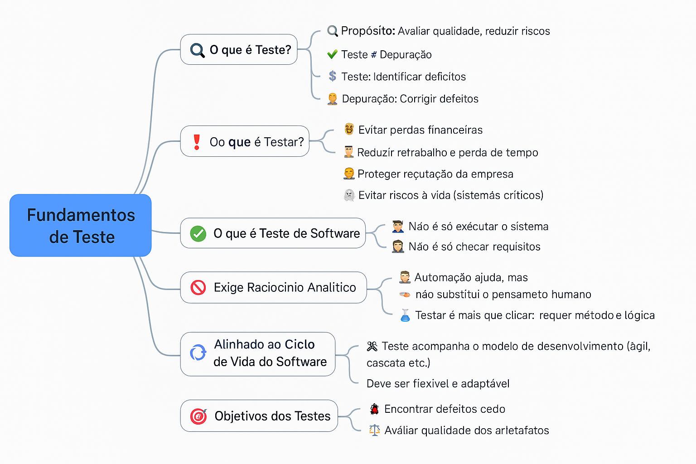

# 📘 README - Fundamentos de Teste de Software

## 🎯 Objetivo (K1)
O primeiro objetivo do teste é relembrar os conceitos básicos, como os propósitos típicos de testar um software.  
👉 Isso inclui entender que os testes não servem apenas para “ver se está funcionando”, mas para garantir confiabilidade, qualidade e redução de riscos.

## 🔎 Diferença entre Teste e Depuração (K2)
Aqui o nível já sobe um pouco (K2), e você deve compreender a diferença entre testar um software e depurar.  
➕ **Teste** é uma atividade planejada que visa encontrar defeitos.  
➖ **Depuração** é o processo técnico de investigar e corrigir esses defeitos no código.

## 🧩 Por que Testar é Importante?
Todo mundo já passou por situações em que um software falhou. Isso pode trazer diversas consequências sérias, como:

### 💸 Perda de dinheiro:
Um software com falhas pode causar prejuízos diretos (ex: falha no app bancário impedindo uma transação) ou indiretos (ex: perda de clientes por conta de má experiência).

### ⏳ Perda de tempo:
Tanto para quem usa quanto para quem desenvolve.  
➡️ O usuário perde tempo tentando repetir ações que falham.  
➡️ A empresa perde tempo alocando equipe para investigar, corrigir e retestar os problemas.

### 👎 Perda de reputação:
Aplicativos com más avaliações ou muitas reclamações em redes sociais/Reclame Aqui sofrem com queda de reputação.  
Isso afasta novos usuários e pode prejudicar gravemente a imagem da empresa.

### ☠️ Riscos graves – ferimentos ou morte:
Sistemas críticos (como de hospitais, aviões, carros autônomos) dependem de software confiável.  
➡️ Uma falha pode literalmente matar. Por isso, em sistemas assim, os testes são ainda mais rigorosos.

## ✅ Definição de Teste de Software

### 📊 Avalia a Qualidade:
Os testes nos ajudam a medir a qualidade do software – ou seja, se ele cumpre o que promete e se funciona corretamente nas situações esperadas.

### 🛡️ Reduz o Risco de Falhas:
Testar não garante um sistema 100% sem bugs, mas reduz o risco de falhas graves chegarem ao usuário.  
A ideia é dar confiança de que o sistema está estável o suficiente para ser usado.

## ❌ O que o Teste de Software não é apenas
É comum achar que testar é só "usar o sistema e ver se funciona", mas vai muito além:

🙅‍♂️ **Não é apenas executar:**  
Testar é um processo com planejamento, análise e estratégias. Envolve conhecer técnicas, preparar ambientes, definir critérios de sucesso, etc.

🙅‍♀️ **Não é só checar requisitos:**  
Embora a verificação de requisitos seja uma parte, também precisamos validar se o sistema atende às verdadeiras necessidades do usuário final (que às vezes não estão nos requisitos!).

## 🔁 Envolve todo um processo
As atividades de teste incluem:

📋 Planejamento  
🔍 Análise  
🧠 Modelagem  
🔧 Implementação  
▶️ Execução  
📈 Relatórios e métricas  

## 🛠️ Testes exigem habilidades analíticas

### 🧠 Atividade intelectual:
Apesar de existirem várias ferramentas e automações, os testes dependem de pensamento crítico, visão sistêmica e olhar detalhista.

### 🤖 Automação é importante, mas não suficiente:
Automatizar testes exige que antes o raciocínio humano tenha pensado bem os cenários, critérios e o que é mais importante testar.

### 🧪 Teste vai além do clique:
Não é só "clicar e ver o que acontece". É uma disciplina dentro da Engenharia de Software que exige métodos, técnicas e raciocínio lógico.

## 🔁 Alinhamento com o Ciclo de Vida do Software

🧩 Os testes devem se adaptar ao modelo de desenvolvimento:  
Ex: Em um modelo ágil, os testes devem ser rápidos e integrados.  
Em um modelo em cascata, devem seguir a sequência das fases.  
✅ Por isso, os testes são flexíveis e devem acompanhar o ritmo do projeto.

## 🔎 Objetivos centrais dos testes

🐞 **Encontrar defeitos o quanto antes:**  
Quanto mais cedo um defeito é identificado, mais barato é para corrigir.

⚖️ **Avaliar a qualidade dos artefatos:**  
Ex: Testar se o código-fonte segue padrões, se a documentação está completa, se as regras estão implementadas corretamente.

🎯 **Validar as necessidades do usuário:**  
Testar se o sistema realmente resolve o problema do cliente, e não só se está “funcionando”.

## 🧠 Mapa Mental
   

